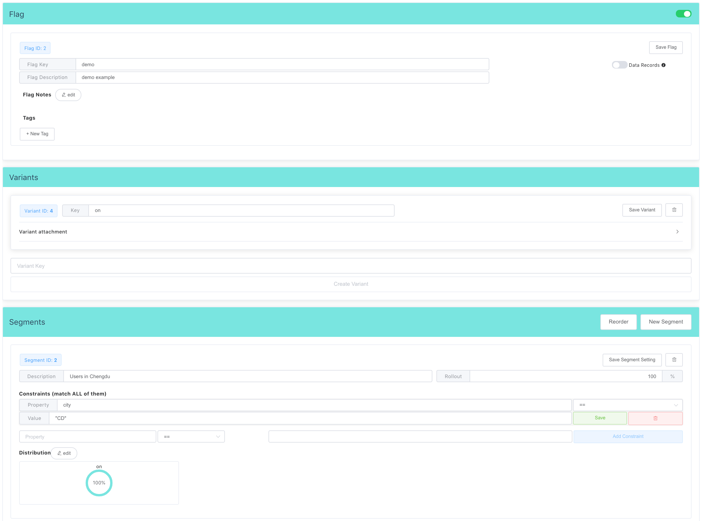

# flagr

A Caddy v2 extension to apply Feature Flags for HTTP requests by using [Flagr][1].


## Installation

```bash
$ xcaddy build --with github.com/RussellLuo/caddy-ext/flagr
```

## Caddyfile Syntax

```
flagr <url> {
    evaluator <evaluator> [<refresh_interval>]
    entity_id <entity_id>
    entity_context {
        <key1>    <value1>
        <key2>    <value2>
        ...
    }
    flag_keys <key1> <key2> ...
    bind_variant_keys_to <bind_variant_keys_to>
}
```

Parameters:

- `<url>`: The address of the flagr server.
- `<evaluator>`: Which evaluator to use. Defaults to `"local"`.
- `<refresh_interval>`: The refresh interval of the internal eval cache (only used for the `"local"` evaluator).
- `<entity_id>`: The unique ID from the entity, which is used to deterministically at random to evaluate the flag result. Must be a [Caddy variable][2].
    + `{path.<var>}`
    + `{query.<var>}`
    + `{header.<VAR>}`
    + `{cookie.<var>}`
    + `{body.<var>}` (requires the [requestbodyvar](https://github.com/RussellLuo/caddy-ext/tree/master/requestbodyvar) extension)
- `<entity_context>`: The context parameters (key-value pairs) of the entity, which is used to match the constraints. The value part may be a Caddy variable (see `<entity_id>`).
- `<flag_keys>`: A list of flag keys to look up.
- `<bind_variant_keys_to>`: Which element of the request to bind the evaluated variant keys. Defaults to `"header.X-Flagr-Variant"`.


## Example

With the Flagr config and the Caddyfile as below:



```
localhost:8080 {
    route /foo {
        flagr http://127.0.0.1:18000/api/v1 {
            entity_id {query.id}
            entity_context {
              city CD
            }
            flag_keys demo
        }
        respond {header.X-Flagr-Variant} 200
    }
    route /bar {
        flagr http://127.0.0.1:18000/api/v1 {
            entity_id {query.id}
            entity_context {
              city BJ
            }
            flag_keys demo
        }
        respond {header.X-Flagr-Variant} 200
    }
}
```

You can get the responses as follows:

```bash
$ curl 'https://localhost:8080/foo?id=1'
demo.on
$ curl 'https://localhost:8080/bar?id=1'
```


## Benchmark

Run Flagr locally [with docker][3], and use the following Caddyfile:

```
localhost:8080 {
    route /local {
        flagr http://127.0.0.1:18000/api/v1 {
            evaluator local
            entity_id {query.id}
            entity_context {
              city CD
            }
            flag_keys demo
        }
        respond 204
    }
    route /remote {
        flagr http://127.0.0.1:18000/api/v1 {
            evaluator remote
            entity_id {query.id}
            entity_context {
              city CD
            }
            flag_keys demo
        }
        respond 204
    }
}
```

By leveraging [wrk][4], here are the benchmark results I got on my MacBook:

```
$ wrk -t15 -c200 -d30s 'https://localhost:8080/local?id=1'
Running 30s test @ https://localhost:8080/local?id=1
  15 threads and 200 connections
  Thread Stats   Avg      Stdev     Max   +/- Stdev
    Latency    12.46ms   12.67ms 179.99ms   86.68%
    Req/Sec     1.29k   270.04     3.03k    72.79%
  576499 requests in 30.09s, 43.43MB read
Requests/sec:  19158.69
Transfer/sec:      1.44MB
```
```
$ wrk -t15 -c200 -d30s 'https://localhost:8080/remote?id=1'
Running 30s test @ https://localhost:8080/remote?id=1
  15 threads and 200 connections
  Thread Stats   Avg      Stdev     Max   +/- Stdev
    Latency    43.11ms   69.84ms   1.01s    89.18%
    Req/Sec   556.06    221.29     2.88k    76.02%
  245288 requests in 30.10s, 18.48MB read
  Socket errors: connect 47, read 0, write 0, timeout 0
Requests/sec:   8150.25
Transfer/sec:    628.78KB
```


[1]: https://github.com/checkr/flagr
[2]: https://caddyserver.com/docs/caddyfile/concepts#placeholders
[3]: https://checkr.github.io/flagr/#/home?id=run
[4]: https://github.com/wg/wrk